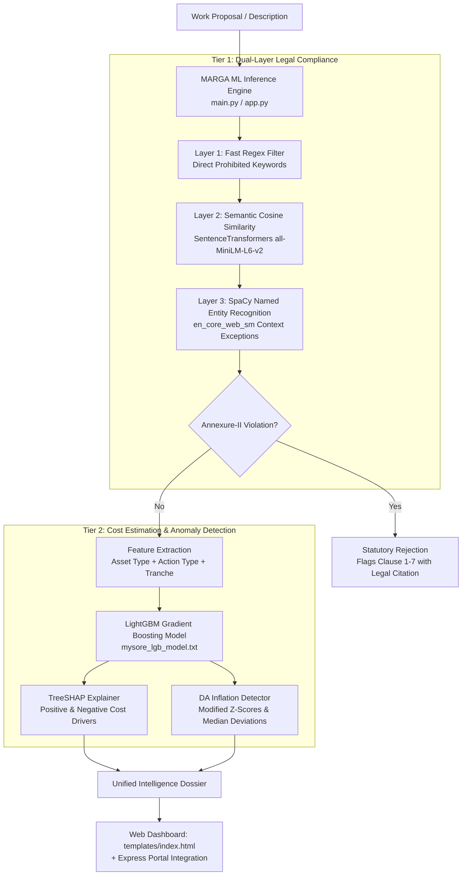

# MARGA ML — The Statutory & Cost Intelligence Brain

> **Directory**: `MARGA ML/`  
> **Runtime**: Python 3.10+ · FastAPI · Uvicorn · LightGBM · TreeSHAP · SentenceTransformers · SpaCy  
> **Interface**: Fast REST API (`/api/v1/projects/*`) + Embedded Intelligence Suite (`templates/index.html`)

**MARGA ML** is the core cognitive decision-support engine of the **MARGA Ecosystem**. It acts as the "True Brain of MARGA", transforming raw project descriptions and financial records into legally compliant, cost-benchmarked, and risk-audited public infrastructure decisions.

---

## 🧠 System Architecture



---

## 🔬 Core Cognitive Modules

### 1. Statutory NLP Compliance Engine (`nlp_compliance.py`)
Enforces the **Revised MPLADS 2023 Guidelines — Annexure II (Prohibited Works)** through a three-layer cascade:

* **Layer 1: Fast Deterministic Regex**: Instantly catches explicit prohibited terms (`statue`, `memorial`, `welcome arch`, `repair of`, `painting of`).
* **Layer 2: Semantic Text Similarity**: Utilizes `sentence-transformers/all-MiniLM-L6-v2` to compute cosine similarity against official MoSPI clause texts. Accurately detects paraphrased violations (e.g., "construction of prayer sanctuary on private trust plot").
* **Layer 3: SpaCy Named Entity Recognition**: Contextual disambiguation using `en_core_web_sm` to differentiate permissible public roads near places of worship from prohibited works *inside* religious compounds.

#### Annexure-II Clause Mapping
* **Clause 1**: Office/residential buildings for private, cooperative, or commercial bodies.
* **Clause 2**: Works inside religious shrines or land owned by religious groups.
* **Clause 3**: Memorials, statues, or naming assets after living individuals.
* **Clause 4**: Purchase of inventory, stock, or consumable equipment.
* **Clause 5**: Acquisition of land or compensation for acquired land.
* **Clause 6**: Routine repairs and maintenance of any existing asset.
* **Clause 7**: Works creating exclusive private individual benefits.

---

### 2. LightGBM Cost Estimator & TreeSHAP (`train_mysore_estimator.py` & `verify_cost_and_shap.py`)
* **Model Artifact**: `mysore_lgb_model.txt` (Booster model) + `mysore_feature_columns.pkl`.
* **Tranche Quantization**: Automatically maps predicted values to standard statutory tranches (₹2.0L, ₹2.5L, ₹4.0L, ₹5.0L, ₹10.0L, ₹15.0L).
* **SHAP Interpretability**: Computes exact feature contributions showing why a project was estimated at a given cost:
  ```json
  "shap_breakdown": {
    "base_value": 450000.0,
    "top_positive_factors": [
      { "feature": "asset_type_COMMUNITY_HALL", "impact": 125000.0 }
    ],
    "top_negative_factors": [
      { "feature": "action_type_UPGRADATION", "impact": -35000.0 }
    ]
  }
  ```

---

### 3. District Authority (DA) Inflation Detector (`detect_da_inflation.py`)
* Computes **Modified Z-Scores** and **Median Absolute Deviation (MAD)** against historical civil works:
  $$\text{Modified Z-Score} = \frac{0.6745 \times (\text{Sanctioned} - \text{Estimated})}{\text{MAD}}$$
* Flags abnormal cost inflation exceeding 1.5x of standard constituency baselines.

---

### 4. Risk-Based Audit (RBA) & Itinerary Generator (`generate_inspection_itinerary.py`)
* Optimizes statutory inspection routes for District Magistrates (10% quota) and State Nodal Officers (1% sample).
* Clusters high-risk assets geographically to minimize field travel time while maximizing audit coverage.

---

## 🌐 Web Dashboard & API Endpoints

### 1. Visual Web Interface (`templates/index.html`)
The embedded web suite provides interactive tabs for instant evaluation:
* **Compliance Evaluator**: Test any work description for Annexure-II clearance.
* **Cost Predictor**: Instant LightGBM cost estimate with visual SHAP waterfall bars.
* **DA Inflation Auditor**: Enter sanctioned cost vs. description to verify contractor margins.
* **Inspection Itinerary Map**: Embedded Leaflet map showing GPS audit markers.

### 2. REST API Endpoints (`main.py`)

| Method | Endpoint | Description |
| :--- | :--- | :--- |
| `GET` | `/` | Serves the interactive HTML Intelligence Suite. |
| `POST` | `/api/v1/projects/evaluate` | Evaluates legal compliance + predicts cost + returns SHAP breakdown. |
| `POST` | `/api/v1/projects/audit` | Audits a sanctioned project for DA inflation and modified z-score anomalies. |
| `GET` | `/api/v1/map/itinerary` | Returns clustered inspection markers with GPS coordinates for mapping. |

---

## 🚀 Running MARGA ML Locally

### Prerequisites
* Python 3.10, 3.11, or 3.12
* Virtual environment (recommended)

### Installation & Setup

1. **Navigate to the ML directory**:
   ```bash
   cd "MARGA ML"
   ```

2. **Create and activate a virtual environment**:
   ```bash
   python -m venv venv
   # On Windows:
   .\venv\Scripts\activate
   # On Linux/macOS:
   source venv/bin/activate
   ```

3. **Install dependencies**:
   ```bash
   pip install -r requirements.txt
   ```

4. **Start the FastAPI server**:
   ```bash
   python -m uvicorn main:app --host 127.0.0.1 --port 8000 --reload
   ```

5. **Access the Intelligence Suite**:
   * Web UI: [http://127.0.0.1:8000](http://127.0.0.1:8000)
   * Interactive API Docs (Swagger): [http://127.0.0.1:8000/docs](http://127.0.0.1:8000/docs)
