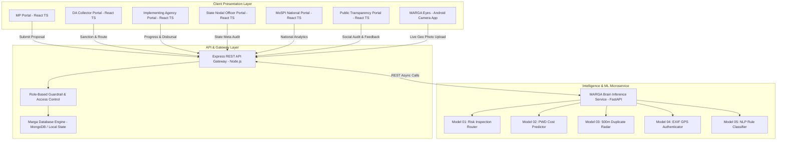
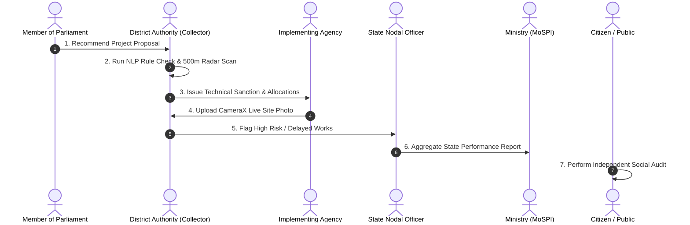
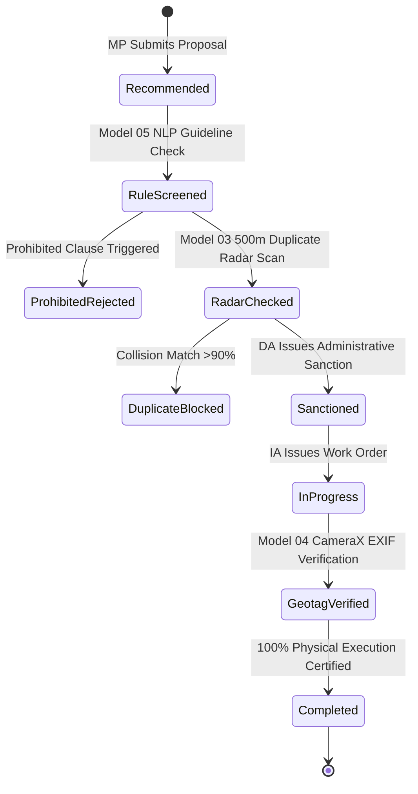
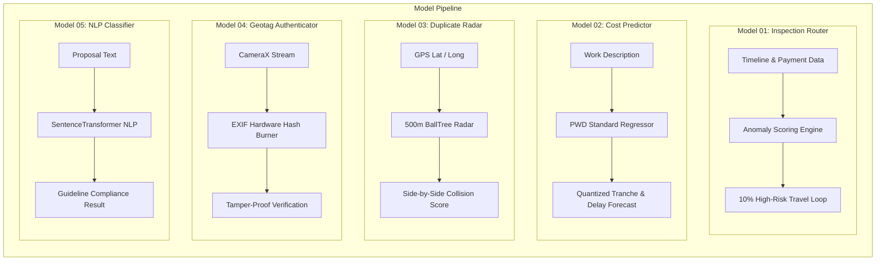
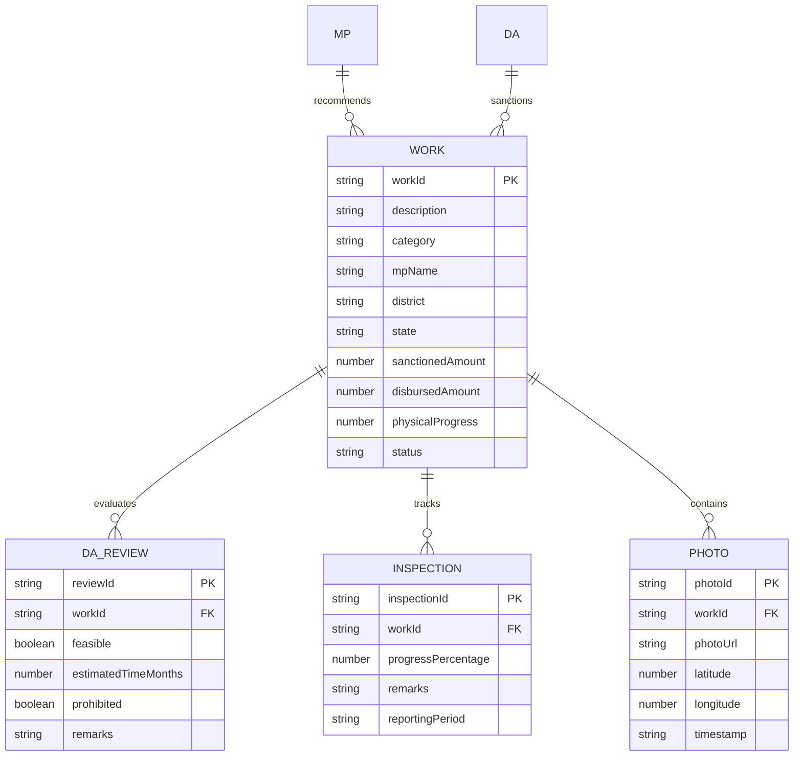

# MARGA: Civic Infrastructure Monitoring & Analytics Platform

> **Multi-Role Civic Infrastructure Operating System for MPLADS**  
> *Monitoring, Analytics, Geotagged Inspection and Verification Platform*

---

## Executive Overview

MARGA is an enterprise-grade civic infrastructure intelligence platform designed to transform the governance, sanctioning, geotagged monitoring, and social auditing of public infrastructure projects under the Member of Parliament Local Area Development Scheme (MPLADS).

By unifying six distinct stakeholder portals, five specialized machine learning engines, and a tamper-proof mobile verification suite, MARGA replaces fragmented manual workflows with automated risk scoring, anti-collision duplicate detection, and intelligent inspection routing.

---

## High-Level System Architecture

The MARGA platform operates on a modular, decoupled architecture consisting of a React-TypeScript Web Portal suite, an Express REST API backend, a Python ML inference microservice, and native Android applications.



---

## Multi-Portal Stakeholder Matrix

MARGA enforces strict role-based data isolation and workflow guardrails tailored for every tier of public administration.



### Role Functionality Breakdown

| Portal Type | Target Stakeholder | Core Administrative Responsibilities | Primary Code Controller |
| :--- | :--- | :--- | :--- |
| **MP Portal** | Member of Parliament | Recommendation submission, constituency fund tracking, sector spend analytics | [src/components/mp/MpPortal.tsx](file:///c:/Users/yashk/Downloads/marga/src/components/mp/MpPortal.tsx) |
| **DA Collector Portal** | District Magistrate / Collector | AI proposal screening, official sanction issuance, inspection route generation | [src/components/da/DaPortal.tsx](file:///c:/Users/yashk/Downloads/marga/src/components/da/DaPortal.tsx) |
| **IA Portal** | Executive Engineer / Agency | Work order execution, financial milestone claims, live site photo uploads | [src/components/ia/IaPortal.tsx](file:///c:/Users/yashk/Downloads/marga/src/components/ia/IaPortal.tsx) |
| **State Nodal Portal** | State Planning Department | Inter-district audit comparison, agency ranking, systemic inflation tracking | [src/components/state/StatePortal.tsx](file:///c:/Users/yashk/Downloads/marga/src/components/state/StatePortal.tsx) |
| **MoSPI Portal** | Ministry HQ (New Delhi) | National macro analytics, state fund utilization dashboard, policy decision support | [src/components/mospi/MospiPortal.tsx](file:///c:/Users/yashk/Downloads/marga/src/components/mospi/MospiPortal.tsx) |
| **Public Portal** | Citizens & Civil Society | Open transparency dashboard, GIS map visualization, social audit feedback | [src/components/public](file:///c:/Users/yashk/Downloads/marga/src/components/public) |

---

## Low-Level Technical Architecture

### 1. Low-Level Work Order Lifecycle State Machine



---

### 2. MARGA Brain: 5 AI Microservice Models Pipeline



### Low-Level Model Specifications

| Model ID | Name | Low-Level Algorithm | Primary Input | Output Verdict | Implementation File |
| :--- | :--- | :--- | :--- | :--- | :--- |
| **Model 01** | Inspection Priority Router | Anomaly Risk Scoring & TSP Traveling Salesman | Timeline delays & drawdowns | Optimized Inspection Itinerary | [marga-ml/rba_anomaly_detector.py](file:///c:/Users/yashk/Downloads/marga/marga-ml/rba_anomaly_detector.py) |
| **Model 02** | Cost & Delay Predictor | LightGBM Booster & SHAP TreeExplainer | Categorical features & text | Budget Tranche & Delay Alert | [marga-ml/mysore_lgb_model.txt](file:///c:/Users/yashk/Downloads/marga/marga-ml/mysore_lgb_model.txt) |
| **Model 03** | Duplicate Radius Radar | 500m BallTree Geospatial Spatial Radar | GPS Lat / Long & Name | Side-by-Side Collision Score | [model3_dashboard.html](file:///c:/Users/yashk/Downloads/marga/model3_dashboard.html) |
| **Model 04** | CameraX Geotag Authenticator | Android CameraX & EXIF Location Metadata | Live camera stream & GPS | Authenticated Tamper-Proof Photo | [mobile/marga-eyes](file:///c:/Users/yashk/Downloads/marga/mobile/marga-eyes) |
| **Model 05** | Rule & Clause Classifier | SentenceTransformers (`all-MiniLM-L6-v2`) | Work description text | Permissible vs Violation Clause | [marga-ml/nlp_compliance.py](file:///c:/Users/yashk/Downloads/marga/marga-ml/nlp_compliance.py) |

---

### 3. Low-Level Database Schema Relationship (ER Diagram)



---

## Interactive Dashboards & Video Demonstrations

The repository includes standalone, high-definition HTML dashboards designed for live demonstrations, video recording, and architectural presentation:

- **[Model 03: 500m Geospatial Duplicate Radar Dashboard](file:///c:/Users/yashk/Downloads/marga/model3_dashboard.html)**  
  Features an interactive Leaflet GIS map with beige topographic tiles, preset road work collision scenarios (side-by-side claim audit for identical road stretches), and real-time vector similarity scoring.

- **[MARGA Platform Architecture: 5 AI Models Visual Roadmap](file:///c:/Users/yashk/Downloads/marga/models.html)**  
  Comprehensive visual storyboard walking through the problem statements, execution pipelines, and interactive demos for all 5 machine learning models.

- **[Technical Architecture & Ecosystem Walkthrough](file:///c:/Users/yashk/Downloads/marga/explaining.html)**  
  Systematic breakdown of the multi-role civic infrastructure operating system layout.

- **[Quick Navigation & Links Hub](file:///c:/Users/yashk/Downloads/marga/links.html)**  
  Direct shortcuts to all static assets, dashboards, and API health verification endpoints.

---

## Repository Structure & Code Base Directory Tree

```
marga/
|-- api/                        # Vercel Serverless Function entry point
|   `-- index.js                # Serverless gateway handler -> [api/index.js](file:///c:/Users/yashk/Downloads/marga/api/index.js)
|-- assets/                     # Platform diagrams, media, and sequence assets
|-- data/                       # Pre-seeded database files
|   `-- marga_database.json     # Primary database JSON state -> [data/marga_database.json](file:///c:/Users/yashk/Downloads/marga/data/marga_database.json)
|-- dataset/                    # Official MPLADS historical datasets
|   |-- json_2026-09-02.json    # Consolidated JSON dataset
|   |-- mplads_completed_works.csv
|   |-- mplads_expenditures.csv
|   |-- mplads_mp_summary.csv
|   `-- mplads_recommended_works.csv
|-- dist/                       # Compiled production web build artifacts
|-- marga-ml/                   # Python ML & Microservice Backend
|   |-- main.py                 # FastAPI inference service entry point -> [marga-ml/main.py](file:///c:/Users/yashk/Downloads/marga/marga-ml/main.py)
|   |-- mysore_lgb_model.txt    # Trained LightGBM cost prediction model
|   |-- nlp_compliance.py       # Sentence Transformer guideline engine -> [marga-ml/nlp_compliance.py](file:///c:/Users/yashk/Downloads/marga/marga-ml/nlp_compliance.py)
|   |-- rba_anomaly_detector.py # Risk-Based Anomaly Scoring module -> [marga-ml/rba_anomaly_detector.py](file:///c:/Users/yashk/Downloads/marga/marga-ml/rba_anomaly_detector.py)
|   `-- requirements.txt        # Python dependency manifest
|-- mobile/                     # Native Android Mobile Applications Suite
|   |-- marga-app-da/           # DA Collector Mobile Portal App
|   |-- marga-app-ia/           # Implementing Agency Mobile Portal App
|   |-- marga-app-mospi/        # MoSPI National Mobile Portal App
|   |-- marga-app-mp/           # MP Mobile Portal App
|   |-- marga-app-public/       # Public Transparency Mobile App
|   |-- marga-app-state/        # State Nodal Officer Mobile App
|   `-- marga-eyes/             # Core CameraX Geotagging Android App -> [mobile/marga-eyes](file:///c:/Users/yashk/Downloads/marga/mobile/marga-eyes)
|-- public/                     # Static assets and standalone dashboards
|   |-- model3_dashboard.html   # Dedicated 500m Geospatial Radar Showcase
|   `-- models.html             # Interactive 5-Model Roadmap Showcase
|-- src/                        # Primary React TypeScript Web Application
|   |-- components/             # Role-specific and shared UI components
|   |   |-- auth/               # Multi-role authentication pages -> [src/components/auth/RoleLoginPage.tsx](file:///c:/Users/yashk/Downloads/marga/src/components/auth/RoleLoginPage.tsx)
|   |   |-- common/             # Visualizers, drawers, modals, header/sidebar
|   |   |-- da/                 # District Authority Portal views -> [src/components/da/DaPortal.tsx](file:///c:/Users/yashk/Downloads/marga/src/components/da/DaPortal.tsx)
|   |   |-- ia/                 # Implementing Agency Portal views -> [src/components/ia/IaPortal.tsx](file:///c:/Users/yashk/Downloads/marga/src/components/ia/IaPortal.tsx)
|   |   |-- mospi/              # MoSPI National Portal views -> [src/components/mospi/MospiPortal.tsx](file:///c:/Users/yashk/Downloads/marga/src/components/mospi/MospiPortal.tsx)
|   |   |-- mp/                 # MP Portal views -> [src/components/mp/MpPortal.tsx](file:///c:/Users/yashk/Downloads/marga/src/components/mp/MpPortal.tsx)
|   |   `-- state/              # State Nodal Officer Portal views -> [src/components/state/StatePortal.tsx](file:///c:/Users/yashk/Downloads/marga/src/components/state/StatePortal.tsx)
|   |-- models/                 # Express backend Mongoose data models -> [src/models](file:///c:/Users/yashk/Downloads/marga/src/models)
|   |-- routes/                 # Express REST API route controllers -> [src/routes/ai.js](file:///c:/Users/yashk/Downloads/marga/src/routes/ai.js)
|   |-- services/               # API clients, database engines, Supabase -> [src/services/apiService.ts](file:///c:/Users/yashk/Downloads/marga/src/services/apiService.ts)
|   |-- types/                  # TypeScript interfaces -> [src/types/index.ts](file:///c:/Users/yashk/Downloads/marga/src/types/index.ts)
|   |-- App.tsx                 # Main Application router & layout -> [src/App.tsx](file:///c:/Users/yashk/Downloads/marga/src/App.tsx)
|   |-- main.tsx                # React application entry point -> [src/main.tsx](file:///c:/Users/yashk/Downloads/marga/src/main.tsx)
|   `-- server.js               # Node.js Express REST API server -> [src/server.js](file:///c:/Users/yashk/Downloads/marga/src/server.js)
|-- docker-compose.yml          # Container orchestration configuration
|-- Dockerfile                  # Container build instructions
|-- index.html                  # Main web entry frame
|-- model3_dashboard.html       # Standalone Model 03 Radar Showcase -> [model3_dashboard.html](file:///c:/Users/yashk/Downloads/marga/model3_dashboard.html)
|-- models.html                 # Standalone 5-Model Visual Roadmap -> [models.html](file:///c:/Users/yashk/Downloads/marga/models.html)
|-- package.json                # Project dependencies -> [package.json](file:///c:/Users/yashk/Downloads/marga/package.json)
|-- tsconfig.json               # TypeScript compiler configuration -> [tsconfig.json](file:///c:/Users/yashk/Downloads/marga/tsconfig.json)
`-- vite.config.ts              # Vite bundler configuration -> [vite.config.ts](file:///c:/Users/yashk/Downloads/marga/vite.config.ts)
```

---

## Local Setup & Hosting

### Prerequisites
- **Node.js**: v18.0.0 or higher
- **npm**: v9.0.0 or higher
- **Python**: v3.10.0 or higher (for `marga-ml`)

### Step-by-Step Installation

1. **Clone the Repository**
   ```bash
   git clone https://github.com/yashkoparde/Viksit-s-M-A-R-G-A.git
   cd marga
   ```

2. **Install Node.js Dependencies**
   ```bash
   npm install
   ```

3. **Start the Platform Server (Port 5000)**
   ```bash
   node src/server.js
   ```
   The application will be accessible at `http://localhost:5000`.

4. **Launch Python ML Service (Optional)**
   ```bash
   cd marga-ml
   pip install -r requirements.txt
   uvicorn main:app --host 0.0.0.0 --port 8000 --reload
   ```

---

## NPM Command Registry

| Script Command | Description | Code Target |
| :--- | :--- | :--- |
| `npm run dev` | Launches Node.js server with nodemon reloading | `src/server.js` |
| `npm run build` | Compiles production TypeScript assets using Vite | `vite.config.ts` |
| `npm run lint` | Executes TypeScript type checking (`tsc --noEmit`) | `tsconfig.json` |
| `npm run start` | Runs production Node.js Express server | `src/server.js` |
| `npm run seed` | Seeds database with official MPLADS sample works | `src/scripts/seedData.js` |
| `npm run import-data` | Imports raw official CSV datasets into system database | `src/scripts/importOfficialData.js` |

---

## License & Attribution

This project is developed under the ISC License. Designed for state and national infrastructure governance, transparency, and social audit enablement under the MPLADS scheme.
