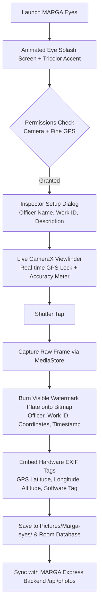

# MARGA Eyes — Native Android Geotagging & Field Inspection Camera

> **Package**: `com.mplads.geotrack`  
> **Platform**: Native Android · Kotlin · Jetpack Compose · Material 3 · CameraX · MediaStore · EXIF  
> **Design System**: Slate Obsidian Base (`#080B12`) with Civic Accents & India Tricolor Header

**MARGA Eyes** is the field inspection mobile application designed for **Implementing Agencies (IA)** and **District Authorities (DA)** under the **MPLADS 2023 Guidelines (Section 5.2)**. It provides tamper-resistant on-site photographic evidence capture with hardware-verified GPS geotagging, visible civic watermark plate burning, and embedded EXIF metadata stamping.

---

## 📸 Core Capabilities



---

## 🛠️ Architecture & Technology Stack

| Layer | Technology | Purpose |
| :--- | :--- | :--- |
| **Language** | Kotlin 1.9+ | Modern, memory-safe native Android development |
| **UI Framework** | Jetpack Compose + Material 3 | Declarative civic UI implementing the Slate Obsidian design system |
| **Camera Engine** | AndroidX CameraX (`1.3.1`) | Device-agnostic hardware camera integration with tap-to-focus and torch control |
| **Location Engine** | FusedLocationProviderClient | Sub-10 meter GPS accuracy validation satisfying Clause 5.2 mandates |
| **Watermark Engine** | Custom Android Canvas (`OverlayUtils.kt`) | Burns immutable civic identification banner directly into JPEG pixels |
| **Metadata Stamping** | ExifInterface (`ExifUtils.kt`) | Writes canonical GPS coordinates, timestamp, and copyright into JPEG headers |
| **Storage & Sync** | MediaStore & Room Database | Offline-first local photo library with automated sync to MARGA backend |

---

## 📂 Source Code Layout

```
marga-eyes/
├── app/
│   ├── build.gradle.kts          # App-level dependencies (CameraX, Compose, Coroutines)
│   └── src/
│       └── main/
│           ├── AndroidManifest.xml # Permissions (CAMERA, ACCESS_FINE_LOCATION, WRITE_EXTERNAL)
│           ├── java/com/mplads/geotrack/
│           │   ├── MainActivity.kt # Master Compose activity & camera state orchestrator
│           │   └── utils/
│           │       ├── LocationHelper.kt # High-precision GPS & reverse geocoding
│           │       ├── OverlayUtils.kt   # Visible civic watermark plate rendering
│           │       └── ExifUtils.kt      # Hardware EXIF GPS & timestamp injection
│           └── res/               # Vector drawables, civic colors, mipmap launcher icons
├── gradle/
│   └── wrapper/                  # Gradle wrapper binaries
├── build.gradle.kts              # Root project build configuration
├── settings.gradle.kts           # Module definitions
└── requirement.md                # Detailed technical specification & design system palette
```

---

## 🎨 Civic Slate Obsidian Design System

MARGA Eyes adopts the statutory civic design palette to ensure high contrast and legibility under direct sunlight on construction sites:

* **Slate Obsidian Base** (`#080B12`): Anti-glare deep backdrop for battery efficiency and high outdoor visibility.
* **Elevated Surface** (`#141C2C`): Dialog surfaces and inspection parameter inputs.
* **Civic Emerald** (`#10B981`): Location GPS lock indicator (shows accuracy within ±10m).
* **Civic Amber** (`#F59E0B`): Work ID highlight badge and torch indicator.
* **National Tricolor** (`#FF9933` / `#FFFFFF` / `#138808`): Emblem header reinforcing official statutory authority.

---

## 🛡️ Statutory Watermark Plate Specification

When a field engineer captures a photo, the app burns a standardized civic stamp onto the lower banner of the image:

```
┌────────────────────────────────────────────────────────────────────────┐
│  MARGA EYES • OFFICIAL MPLADS STATUTORY VERIFICATION                   │
│  Officer: Er. R. Sharma (Executive Engineer, PWD)                     │
│  Work ID: 163645 • Upgradation of CC Road Ukkinakantte Village        │
│  GPS: 12.3052° N, 76.6554° E (Accuracy: ±4.2m) • Altitude: 763m       │
│  Timestamp: 2026-09-03 14:32:10 IST • Mysore, Karnataka               │
└────────────────────────────────────────────────────────────────────────┘
```

---

## 🚀 Building & Running Locally

### Prerequisites
* **Android Studio** (Hedgehog 2023.1.1 or Ladybug / Koala recommended)
* **Android SDK** (API Level 34 / Android 14)
* **Physical Android Device** with GPS and Camera (emulators lack real-time GPS sensors)

### Build Commands

1. **Navigate to the mobile directory**:
   ```bash
   cd marga-eyes
   ```

2. **Clean and compile the project**:
   ```bash
   ./gradlew clean
   ```

3. **Build the Debug APK**:
   ```bash
   ./gradlew assembleDebug
   ```
   * The generated APK will be located at:
     `app/build/outputs/apk/debug/app-debug.apk`

4. **Install directly onto connected USB debugging device**:
   ```bash
   ./gradlew installDebug
   ```

---

## 🔄 Integration with MARGA Platform Backend

Photos captured in MARGA Eyes are exported and synchronized with the Express backend:
* **Upload Endpoint**: `POST http://<server-ip>:5000/api/photos/upload`
* **Payload**: Form-data containing the watermarked JPEG image along with `workId`, `latitude`, `longitude`, `officerName`, and `inspectionPhase`.
* **Visibility**: Once uploaded, photos immediately populate the **IA Field Verification Feed** and **Leaflet Map** across all 5 web portals.
