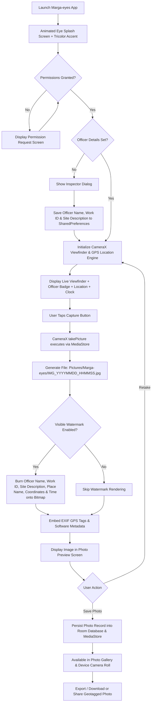

# Marga-eyes — Geotagged Camera Application Technical Documentation

## 📌 Executive Summary
**Marga-eyes** is a modern, human-crafted native Android application built in Kotlin with Jetpack Compose. It adopts the official **MARGA Slate Obsidian & Civic Design System Palette**, featuring real-time camera capture with automatic high-precision GPS geotagging, Inspector details (Officer Name, Work ID, and Work Description), reverse-geocoded place names, embedded EXIF metadata, custom visible watermark plates burned directly onto saved photos, direct photo gallery export, India tricolor accent stripes, and an official animated splash screen.

---

## 🛠️ Technology Stack & Color Design System

### 🎨 MARGA Slate Obsidian & Civic Accents Palette

| Palette Variable | Color Name | HEX Code | Design System Role |
| :--- | :--- | :---: | :--- |
| `--bg-base` | Slate Obsidian Base | `#080B12` | App background, top & navigation status bars |
| `--bg-surface` | Slate Surface Dark | `#0E1420` | Cards, dialogs, bottom sheets, preview containers |
| `--bg-surface-elevated` | Elevated Navy Surface | `#141C2C` | Input fields, active elevated chips |
| `--border-subtle` | Subtle Border | `rgba(255,255,255,0.08)` | Card outlines, dividers |
| `--border-medium` | Medium Border | `rgba(255,255,255,0.16)` | Active card focus outlines |
| `--civic-blue` | Civic Blue | `#3B82F6` | Primary MP Portfolio accent & focus highlights |
| `--civic-amber` | Civic Amber | `#F59E0B` | DA Sanctions, Work ID badges, torch indicator |
| `--civic-emerald` | Civic Emerald | `#10B981` | IA Field Verification, location lock, photo watermark plate |
| `--civic-purple` | Civic Purple | `#8B5CF6` | MoSPI Command & analytics highlights |
| `--civic-red` | Civic Red | `#EF4444` | Anomalies, rejections, photo deletion buttons |
| `--text-primary` | Slate 50 Primary Text | `#F8FAFC` | Headlines, primary text, shutter button core |
| `--text-secondary` | Slate 400 Secondary Text | `#94A3B8` | Coordinates, timestamps, place labels |
| `--text-muted` | Slate 500 Muted Text | `#64748B` | Subdued icons, footer legal text |
| **Gov Tricolor** | India Flag Stripe | `#FF9933` / `#FFFFFF` / `#138808` | Official India tricolor accent header |

---

## 🔄 Application Workflow



---

## 📦 Required Dependencies (`app/build.gradle.kts`)

```kotlin
dependencies {
    // Jetpack Compose BOM & UI Kits
    implementation(platform("androidx.compose:compose-bom:2024.10.00"))
    implementation("androidx.compose.ui:ui")
    implementation("androidx.compose.ui:ui-graphics")
    implementation("androidx.compose.ui:ui-tooling-preview")
    implementation("androidx.compose.material3:material3")
    implementation("androidx.compose.material:material-icons-extended")

    // Activity & Navigation Compose
    implementation("androidx.activity:activity-compose:1.9.3")
    implementation("androidx.navigation:navigation-compose:2.8.3")

    // CameraX Libraries
    val cameraVersion = "1.4.0"
    implementation("androidx.camera:camera-core:$cameraVersion")
    implementation("androidx.camera:camera-camera2:$cameraVersion")
    implementation("androidx.camera:camera-lifecycle:$cameraVersion")
    implementation("androidx.camera:camera-view:$cameraVersion")

    // Google Play Services Location
    implementation("com.google.android.gms:play-services-location:21.3.0")

    // EXIF Metadata Interface
    implementation("androidx.exifinterface:exifinterface:1.3.7")

    // Room Database
    val roomVersion = "2.6.1"
    implementation("androidx.room:room-runtime:$roomVersion")
    implementation("androidx.room:room-ktx:$roomVersion")
    ksp("androidx.room:room-compiler:$roomVersion")

    // Coil Image Loading
    implementation("io.coil-kt:coil-compose:2.7.0")

    // Coroutines
    implementation("org.jetbrains.kotlinx:kotlinx-coroutines-android:1.9.0")
    implementation("org.jetbrains.kotlinx:kotlinx-coroutines-play-services:1.9.0")

    // Core KTX & Lifecycle
    implementation("androidx.core:core-ktx:1.13.1")
    implementation("androidx.lifecycle:lifecycle-runtime-ktx:2.8.6")
    implementation("androidx.lifecycle:lifecycle-viewmodel-compose:2.8.6")
}
```
