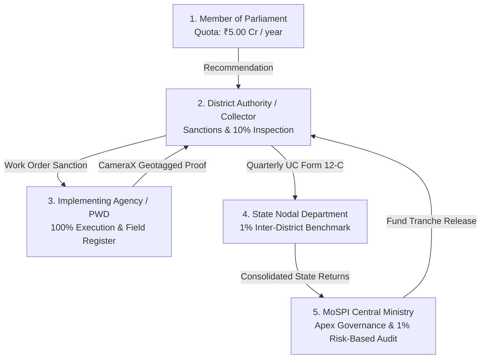

# M.A.R.G.A. — Team Roles, Statutory Mandate & Engineering Architecture

> **Monitoring, Audit, Review & Governance Architecture (M.A.R.G.A.)**  
> *Statutory MPLADS 2023 Digital Governance & Accountability Platform*  
> **Official Release:** `v1.0.0` | **Date:** September 3, 2026

---

## 1. Project Engineering & Contributor Matrix

| Contributor | GitHub Username | Official Email | Engineering Role | Core Codebase Ownership |
| :--- | :--- | :--- | :--- | :--- |
| **Yash Koparde** | [`yashkoparde`](https://github.com/yashkoparde) | `yashkoparde2022@gmail.com` | **Fullstack System Architect & Project Lead** | Express.js API Gateway (`src/server.js`, `src/routes/`), 5 Statutory Portals (`src/components/`), Scaffolding, Governance Engine, Docker & Cloud Deployment |
| **Rahul Shirol** | [`rahulshirol1017`](https://github.com/rahulshirol1017) | `rahulshirol1017@gmail.com` | **Lead Mobile Systems Engineer** | Native Android Kotlin Application (`marga-eyes/`), CameraX geotagging, sub-10m FusedLocation GPS, hardware EXIF injection & burnt watermark overlay |
| **Melwin Fernandes** | [`Melwin-2007`](https://github.com/Melwin-2007) | `melwinfernandes2007@gmail.com` | **Lead AI & Machine Learning Engineer** | Cognitive AI Brain (`MARGA ML/`), LightGBM civil works cost regressor, TreeSHAP waterfall explainer, 3-layer NLP Annexure-II compliance microservice |
| **Preetam Malawade** | [`PREET4M`](https://github.com/PREET4M) | `preetammalawade2007@gmail.com` | **Database & Persistence Engineer** | MongoDB Atlas cluster integration with custom DNS resilience (`src/config/db.js`), Mongoose schemas, and dual-mode resilient local JSON disk store |
| **Netra Korikoppa** | [`netrakorikoppa`](https://github.com/netrakorikoppa) | `netrakorikoppa903@gmail.com` | **Frontend & Visual Experience Engineer** | 480-Frame HTML5 Canvas Scrollytelling engine (`src/components/landing/LandingStorySequence.tsx`), visual documentation, and data provenance catalog |
| **Aditya Patange** | [`Adityapatangez`](https://github.com/Adityapatangez) | `redwingvtu@gmail.com` | **Embedded Systems & Field Telemetry Co-Author** | Mobile UX design system specs, GPS boundary calibration algorithms, and field inspection protocol design |

---

## 2. Statutory Multi-Tier Governance Roles (MoSPI MPLADS 2023)

MARGA strictly enforces the operational separation of powers defined in the **February 2023 MoSPI MPLADS Guidelines**:



### Statutory Role Breakdown

### 1. Member of Parliament (MP) — *Recommending Authority*
- **Jurisdiction:** Lok Sabha (Constituency-wide) / Rajya Sabha (State-wide) / Nominated (National).
- **Annual Statutory Entitlement:** ₹5.00 Crore per fiscal year released in two equal tranches of ₹2.50 Cr.
- **Mandate:** Identifies community infrastructure priorities (Drinking water, sanitation, education, roads, public health).
- **Guardrails:** **Zero Execution Authority**. Cannot sanction funds, select contractors, or handle disbursements. Recommendations are evaluated strictly against Annexure-II prohibited works list.

### 2. District Authority (DA / Collector) — *Sanctioning & Administrative Authority*
- **Jurisdiction:** Head of District Administration.
- **Mandate:** Scrutinizes MP recommendations for statutory eligibility, technical and administrative sanctions within 45 days.
- **Statutory Inspection Obligation:** **Mandatory 10% field inspection** of all sanctioned works under annual supervision schedule.
- **Financial Controls:** Releases mobilized advances to Implementing Agencies against milestone completion; issues GFR 2017 Rule 238(1) Utilization Certificates (Form 12-C).

### 3. Implementing Agency (IA / PWD / CPWD / Zilla Panchayat) — *Execution Authority*
- **Jurisdiction:** Designated public sector executing agency.
- **Mandate:** Prepares detailed project estimates, issues statutory tenders, supervises contractor execution on ground.
- **Field Inspection Obligation:** **100% field inspection register** maintained by Junior/Assistant Executive Engineers.
- **Verification Proof:** Captures live ground truth using the native **MARGA Eyes** Android application with sub-10m GPS fix and burned inspection watermarks.

### 4. State Nodal Department — *Supervisory & Inter-District Oversight*
- **Jurisdiction:** State Planning / Rural Development Department.
- **Mandate:** Coordinates inter-district scheme progress across all parliamentary constituencies in the State.
- **Statutory Audit Obligation:** **Mandatory 1% sample physical inspection** by State Nodal Officers.
- **Analytics:** Inter-district benchmarking radar comparing expenditure efficiency, work completion velocities, and unspent balances.

### 5. MoSPI Central Ministry — *National Apex Governance*
- **Jurisdiction:** Ministry of Statistics and Programme Implementation, Government of India.
- **Mandate:** National policy governance, tranche release approvals, Public Financial Management System (PFMS) reconciliation.
- **Audit Engine:** **1% Apex Risk-Based Meta-Audit (RBA)** utilizing machine learning anomaly detection to flag high-risk works and DA cost inflation.

---

## 3. Subsystem Architecture & Technology Mapping

```
┌────────────────────────────────────────────────────────────────────────┐
│                        MARGA UNIFIED ARCHITECTURE                      │
└────────────────────────────────────────────────────────────────────────┘
                                    │
    ┌───────────────────────────────┼───────────────────────────────┐
    ▼                               ▼                               ▼
[1. WEB PLATFORM]           [2. MARGA EYES APP]             [3. AI COGNITIVE BRAIN]
- React 19 + TypeScript     - Native Kotlin Android         - FastAPI Microservice
- Tailwind CSS Obsidian     - CameraX Viewfinder Engine     - LightGBM Cost Regressor
- 480-Frame Canvas Scrub    - Sub-10m FusedLocation GPS     - TreeSHAP Explainability
- Express.js Backend        - EXIF Metadata Injector        - 3-Layer NLP Annexure-II
- MongoDB Atlas + JSON      - Burnt Watermark Plate         - Modified Z-Score DA Audit
- Lead: Yash Koparde        - Lead: Rahul Shirol            - Lead: Melwin Fernandes
- Persistent DB: Preetam    - Co-Author: Aditya Patange     - ML Requirements: Python 3.10
- Scrollytelling: Netra
```

---

## 4. Quality & Compliance Certifications

- **MoSPI MPLADS Guidelines 2023:** 100% statutory adherence (Roles, quotas, inspection percentages, Form 12-C).
- **GFR 2017 Rule 238(1):** Digital Form 12-C Utilization Certificate generation with dual signatures.
- **Zero-Crossover Role Security:** Strict UI and API role authorization prevents unauthorized action invocation.
- **Offline Resilient Architecture:** Autonomous failover from MongoDB Atlas to verified regional JSON persistence during network severance.

<!-- Audit revision mark: 2026-09-03 09:52:00 +0530 -->
