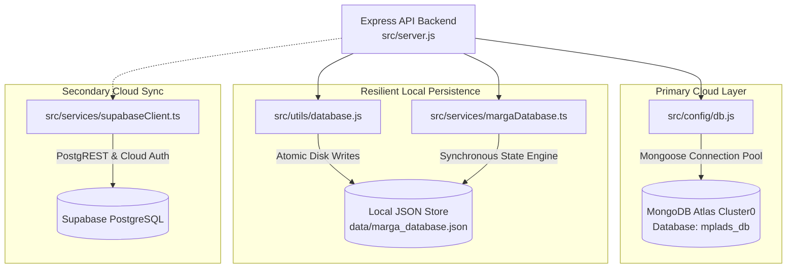

# MARGA Database Architecture & Connectivity Layer

> **Path**: `src/config/` & `src/services/`  
> **Engines**: MongoDB Atlas (Primary Cloud) · Local Persistent On-Disk Store (Resilient Fallback) · Supabase (Secondary Cloud)

This layer manages data persistence, transaction integrity, and statutory audit logging across the **MARGA platform**. It is designed with a **dual-engine resilient architecture**, ensuring uninterrupted operations during hackathon demonstrations and field deployments even in offline or restricted-network environments.

---

## 🏗️ Connectivity Topology



---

## 🗄️ Core Database Modules

### 1. MongoDB Atlas Connector (`src/config/db.js`)
* **Connection Method**: Mongoose with SRV DNS record resolution.
* **DNS Resilience**: Configured with custom authoritative DNS servers (`8.8.8.8`, `1.1.1.1`, `8.8.4.4`) to prevent DNS SRV lookup timeouts on Windows and cellular hotspot environments.
* **Connection Pool Config**:
  ```javascript
  {
    dbName: 'mplads_db',
    serverSelectionTimeoutMS: 8000,
    maxPoolSize: 20,
    retryWrites: true,
    w: 'majority'
  }
  ```
* **Replica Set Fallback**: Automatically attempts direct node connection if SRV resolution fails.

### 2. Local Persistent Storage Engine (`src/utils/database.js` & `src/services/margaDatabase.ts`)
* **Storage Location**: `data/marga_database.json` (4.6 MB authoritative baseline).
* **Guarantees**:
  * **Zero-External-Dependency**: Allows full portal operations, work recommendation, AS/TS approvals, and inspections without internet or MongoDB connectivity.
  * **Live Synchronization**: Updates in-memory stores and flushes serialized JSON to disk on every mutating action.
  * **Statutory Compliance Checks**: Validates expenditure bounds, 15% lead restrictions, and duplicate work prevention at the storage layer.

### 3. Supabase Cloud Integration (`src/services/supabaseClient.ts`)
* **Role**: Provides secondary cloud persistence, official role session authentication profiles, and audit logging.
* **Pre-configured Profiles**: Stores authorized statutory test profiles for all 5 administrative tiers:
  * MP: `Shri Daggumalla Prasada Rao (Chittoor, AP)`
  * DA: `District Magistrate & Collector, Chittoor`
  * IA: `Executive Engineer, PWD Chittoor Division`
  * State: `Principal Secretary, Planning Department (Govt of AP)`
  * MoSPI: `Director (MPLADS), MoSPI HQ, New Delhi`

---

## 📋 Mongoose Data Models (`src/models/`)

| Model File | Collection | Description |
| :--- | :--- | :--- |
| **`Work.js`** | `works` | Canonical project register tracking Work ID, MP details, category, sanctioned cost, disbursed expenditure, physical progress %, status, and GPS coordinates. |
| **`MP.js`** | `mps` | Parliamentary constituency profiles: total ₹5.00 Cr quota, cumulative sanctions, unspent funds, and SC/ST quota allocations. |
| **`State.js`** | `states` | State-level metrics aggregating all districts, fund absorption velocity, and compliance rates. |
| **`DAReview.js`** | `da_reviews` | Formal Administrative Sanction (AS) and Technical Sanction (TS) audit determinations, pre-screening logs, and rejection notices. |
| **`Inspection.js`** | `inspections` | 100% monthly and 10% annual field inspection reports with milestone status and officer signatures. |
| **`Photo.js`** | `photos` | Geotagged photographic records containing verified latitude, longitude, reverse-geocoded location, timestamp, and asset phase. |
| **`Report.js`** | `reports` | Form 12-C Utilization Certificates, monthly returns, and audit ledger snapshots. |

---

## 🔍 Database Health & Status Endpoints

The server exposes dedicated monitoring endpoints for the frontend top bar and operational dashboards:

* **`GET /api/health`**:
  ```json
  {
    "status": "online",
    "database": "connected",
    "cluster": "Cluster0",
    "dbName": "mplads_db",
    "timestamp": "2026-09-03T12:00:00.000Z",
    "platform": "MPLADS Monitoring & Analytics System"
  }
  ```

* **`GET /api/db-status`**: Returns live collection record counts across all 7 statutory collections.
